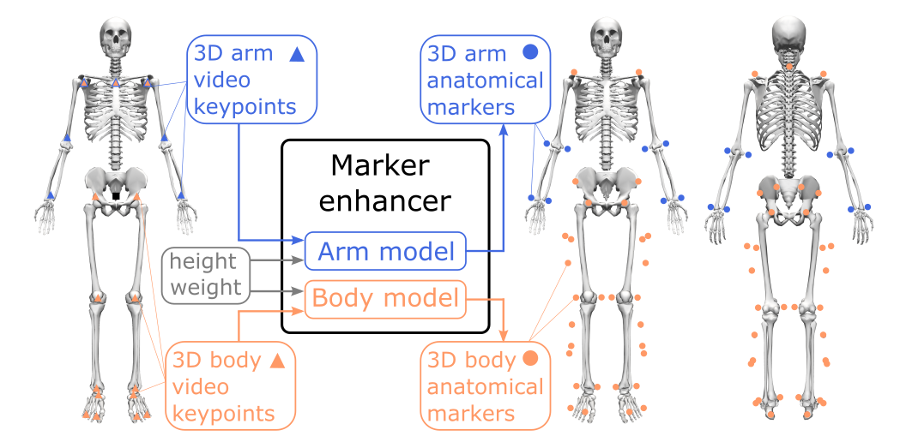

# Marker enhancer
This repository contains code and trained models used for the paper ["Marker Data Enhancement for Markerless Motion Capture"](https://ieeexplore.ieee.org/document/10844513). 

The marker enhancer model predicts the 3D position of 43 anatomical markers (colored dots on right skeletons) from 20 video keypoint (colored triangles on left skeleton) positions. It consists of two models: the arm model predicts the 3D position of eight arm-located anatomical markers from seven arm and shoulder keypoint positions (blue) and the body model predicts the 3D position of 35 anatomical markers located on the shoulder, torso, and lower-body from 15 shoulder and lower-body keypoint positions (orange).

<p align="center">
  
</p>

The marker enhancer is deployed as part of [OpenCap](https://www.opencap.ai/) ([source code](https://github.com/stanfordnmbl/opencap-core); [paper](https://journals.plos.org/ploscompbiol/article?id=10.1371/journal.pcbi.1011462)), a markerless motion capture system to measure human movement from smartphone videos.

The code is organized into different sections for data preparation, training, and testing of the models.

### Install requirements

1. Create environment: `conda create -n marker-enhancer python=3.11`
2. Activate environment: `conda activate marker-enhancer`
3. Install [TensorFlow with GPU support](https://www.tensorflow.org/install/pip).
3. Install other packages: `python -m pip install -r requirements.txt`

### Data

### Reference models
1. LSTM: 
2. Transformer: 
3. Linear: 

### Training
1. LSTM: `train_lstm.py`
2. Transformer: `train_transformer.py`

### Testing
1. LSTM: `test_lstm.py`
2. Transformer: `test_transformer.py`

### Citation
If you use this code in your research, please cite our paper:
```bibtex
@ARTICLE{10844513,
  author={Falisse, Antoine and Uhlrich, Scott D. and Chaudhari, Akshay S. and Hicks, Jennifer L. and Delp, Scott L.},
  journal={IEEE Transactions on Biomedical Engineering},
  title={Marker Data Enhancement for Markerless Motion Capture},
  year={2025},
  volume={},
  number={},
  pages={1-10},
  keywords={Three-dimensional displays;Data models;Hip;Solid modeling;Accuracy;Training;Predictive models;Long short term memory;Computational modeling;Biomedical engineering;Deep learning;markerless motion capture;musculoskeletal modeling and simulation;pose estimation;trajectory optimization},
  doi={10.1109/TBME.2025.3530848}
}